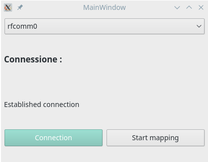

# sonarQt
This is part of an university project made during my 
Erasmus in Porto at ISEP (Instituto Superior de Engenharia do Porto).

## The main project
The main project ([Available here](https://github.com/ilgaiaz/sonar-mapping)) has the purpose to create a 2D map of a room using the microcontroller atmega328p, a stepper motor and a sonar sensor. 
For create the map is necessary send the data about distance and position (of objects detected by the sonar), throught a serial connection to the PC.
On the PC side the Python code provide to read the data and create a plot. 

## The interface
This project started at the end of the main one for create a very simple GUI. 
The GUI give the possibility to select the serial port, create the connection and enable the mapping.
Below is possible to see the GUI.



## Install
Before using the program is necessary to configure the graphic and the connection (required only with the bluetooth module).

### Graphic
The project require to build the graphic class from the `sonar.ui` file.
For do that is necessary run the `build.sh` file. The script will create a folder with the class used from the main program.

### Connection (Arch)
If the connection is made with the bluetooth module is mandatory to create the serial connection before using it. 
For do that according with [ArchWiki](https://wiki.archlinux.org/index.php/Bluetooth#Console) 
is necessary to:
1. Pair the HC-05 (follow instruction on WikiArch)
2. Create the serial comunication port

The second point can be made with this commands:

```
sudo modprobe rfcomm
sudo rfcomm bind rfcomm0 <device's MAC>
```

Check the connection with:

```
ls /dev |grep rfcomm
```

## Run
After the configuration the code is ready and is possible run the `main.py` file.
